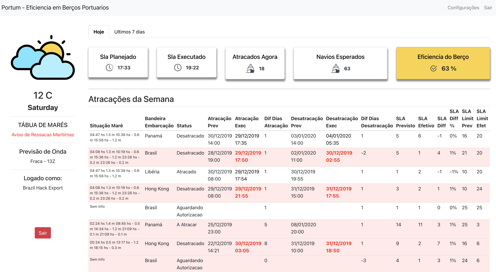
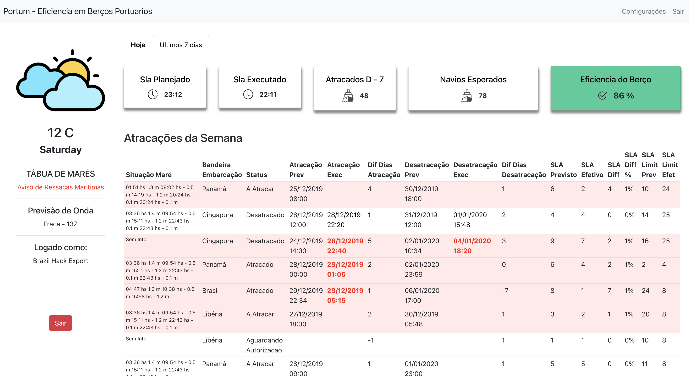
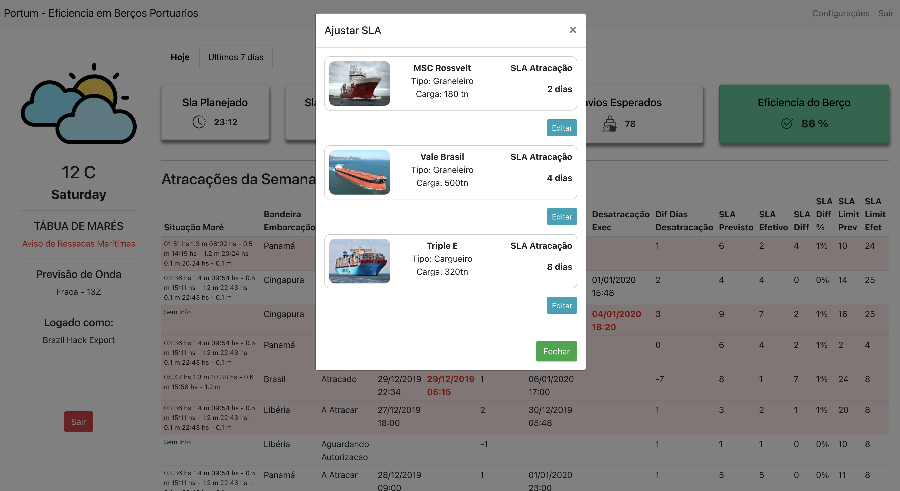

## Portum Platform

 Hackathon Brasil Hack Export - plataforma disponivel hein : http://portum.surge.sh/

## Techs

- [x] React JS
- [x] Axios
- [x] Axios
- [x] Reactstrap
- [x] Styled Components
- [x] Surge

## Usage

1. Run `yarn` for install dependencies. 
2. Run `yarn start` and access `http://localhost:3000`. 

- Visão inicial Home - Validação de sla`s atração e desatração

- Visao de atracagem d - 7 -

- Configuração de SLA em tempo real

## License

[GPL-3.0](emersonjds@fsf.com) © Emerson Silva
